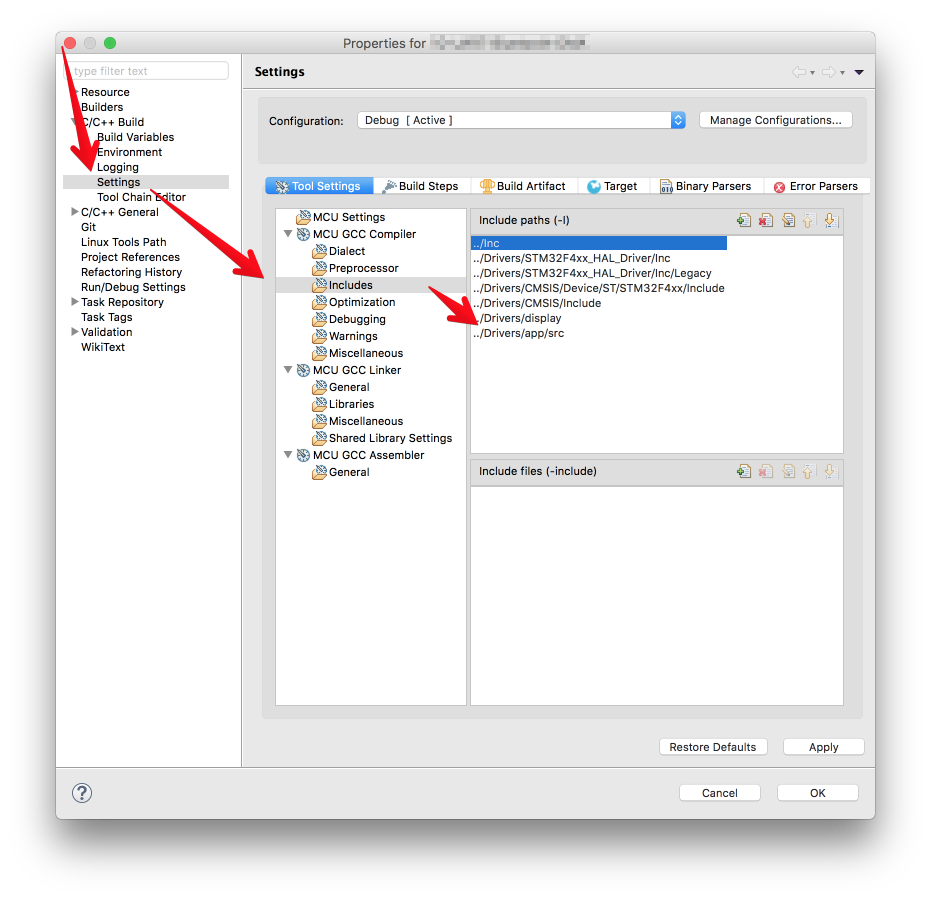

# AppUtil


## Install

```
git submodule add git@github.com:GoliathUA/C_STM32_AppLib.git Drivers/app
```



## Use

```c
void function_a(void) 
{
    LCD_Printf("Function\n");
}

int main(void)
{
    APP_CallbackMapTypeDef *map = APP_CreateCallbackMap(1);

    APP_SetCallbackMapItem(map, "key1", function_a);
    
    APP_CallbackTypeDef callback = APP_GetCallbackMapItem(map, "key1");
    callback();
}
```